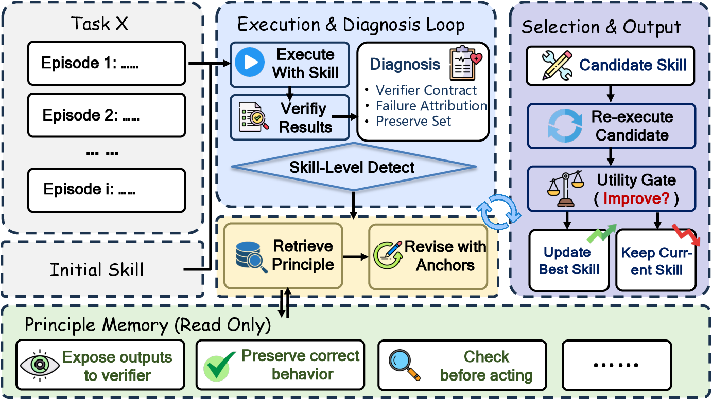

# SkillRevise

[](https://arxiv.org/abs/2606.01139)
[](LICENSE)

Official release for **SkillRevise: Improving LLM-Authored Agent Skills via Trace-Conditioned Skill Revision**.

SkillRevise improves cold-start agent skills by treating a skill as an execution-grounded artifact. Starting from an initial LLM-authored skill, it executes the task, diagnoses verifier-facing failures, retrieves reusable repair principles, revises the skill with execution anchors, re-executes the candidate, and returns the best observed skill under a utility gate.



## Highlights

- **Trace-conditioned skill revision.** SkillRevise revises imperfect skills from execution traces and verifier feedback instead of relying only on expert authoring, retrieval, or one-shot skill generation.
- **Three-part method.** The framework combines task-specific Diagnosis, reusable Principle Memory, and an anchored Revision Operator.
- **Utility-gated selection.** Each candidate skill is re-executed and selected by measured utility, so the returned skill is the best observed version within the revision budget.
- **Unified benchmark interface.** The release includes final SkillsBench-style bundles for SkillsBench, SkillLearnBench-Random, and SWE-Skills-Bench-Hard.

## Main Results

The paper evaluates SkillRevise across three verifier-driven benchmarks and five executors. On the GPT-5.5 main setting, SkillRevise with a three-round revision budget improves over both no-skill execution and one-shot Skill-Creator:

| Benchmark | No skill | Skill-Creator | SkillRevise v3 |
| --- | ---: | ---: | ---: |
| SkillsBench | 31/86 | 34/86 | **53/86** |
| SkillLearnBench-Random | 20/50 | 17/50 | **29/50** |
| SWE-Skills-Bench-Hard | 28/70 | 27/70 | **33/70** |

The revised skills also show cross-model transfer behavior: fixed GPT-5.5-produced skills improve several target executors on the 57-task GPT-5.5 source-success subset, while executor-specific revision remains strongest in most cases.

## Repository Contents

- `skillrevise/`: Python package and CLI.
  - `core/`: task/result models, execution loop, runners, metrics, artifacts, and reporting.
  - `method/`: skill authoring, diagnosis, revision, skill parsing, and principle memory.
  - `benchmarks/`: SkillsBench loading, SkillLearnBench and SWE-Skills-Bench conversion, ALFWorld loading, verifier helpers, and task selection.
  - `llm/`: command-based LLM client and provider wrapper used by `skillrevise-llm`.
- `data/`: final SkillsBench-style benchmark bundles used by the main experiments.
- `scripts/`: benchmark export, task selection, and skill-audit helpers.
- `docs/`: method, benchmark, and running documentation.
- `tests/`: unit tests for the public package and scripts.

## Quick Start

```bash
python -m venv .venv
source .venv/bin/activate
python -m pip install -U pip
python -m pip install -e ".[dev,benchmarks]"
pytest
```

Run a one-task baseline smoke check:

```bash
skillrevise data/skillsbench/skillsbench_tasks.json \
  --manifest-kind skillsbench \
  --workspace-root . \
  --baseline-only \
  --limit 1 \
  --output runs/baseline_smoke.json
```

Run an LLM-backed SkillRevise episode:

```bash
skillrevise data/skillsbench/skillsbench_tasks.json \
  --manifest-kind skillsbench \
  --workspace-root . \
  --limit 1 \
  --author-mode llm-principle-bank \
  --diagnosis-mode llm \
  --revision-mode llm-principle-bank \
  --llm-command "python -m skillrevise.llm.command" \
  --output runs/llm_run.json \
  --summary-output runs/llm_summary.json \
  --max-revisions 3
```

The bundled `skillrevise-llm` command reads prompts from stdin and writes completions to stdout. Configure provider credentials with environment variables such as:

```bash
export SKILL_REVISE_REVISION_LLM_PROVIDER=openai
export SKILL_REVISE_REVISION_LLM_MODEL="<model-name>"
export SKILL_REVISE_REVISION_LLM_API_KEY="<api-key>"
```

## Benchmark Bundles

All three main benchmark bundles are already materialized in a SkillsBench-style layout and can be loaded with `--manifest-kind skillsbench`:

| Bundle | Tasks | Manifest |
| --- | ---: | --- |
| `data/skillsbench/` | 86 | `data/skillsbench/skillsbench_tasks.json` |
| `data/skilllearnbench/` | 50 | `data/skilllearnbench/skillsbench_tasks.json` |
| `data/swe-skills-bench/` | 70 | `data/swe-skills-bench/skillsbench_tasks.json` |

See [docs/benchmarks.md](docs/benchmarks.md) for bundle structure and loading details.

## Documentation

- [Overview](docs/overview.md)
- [Bundled Benchmarks](docs/benchmarks.md)
- [Running SkillRevise](docs/running.md)

## Citation

If you use SkillRevise in research, please cite the paper:

```bibtex
@misc{liu2026skillrevise,
  title = {SkillRevise: Improving LLM-Authored Agent Skills via Trace-Conditioned Skill Revision},
  author = {Liu, Yuxuan and Su, Zhaochen and Xie, Lingyun and Zhang, Yuhao and Zong, Qing and Guo, Jiahe and Xie, Zhongwei and Ji, Yiyan and Yim, Yauwai and Luo, Hongyu and Ren, Xiyu and Ruan, Chenyu and Li, Haoran and Song, Yangqiu},
  year = {2026},
  eprint = {2606.01139},
  archivePrefix = {arXiv},
  url = {https://arxiv.org/abs/2606.01139}
}
```
