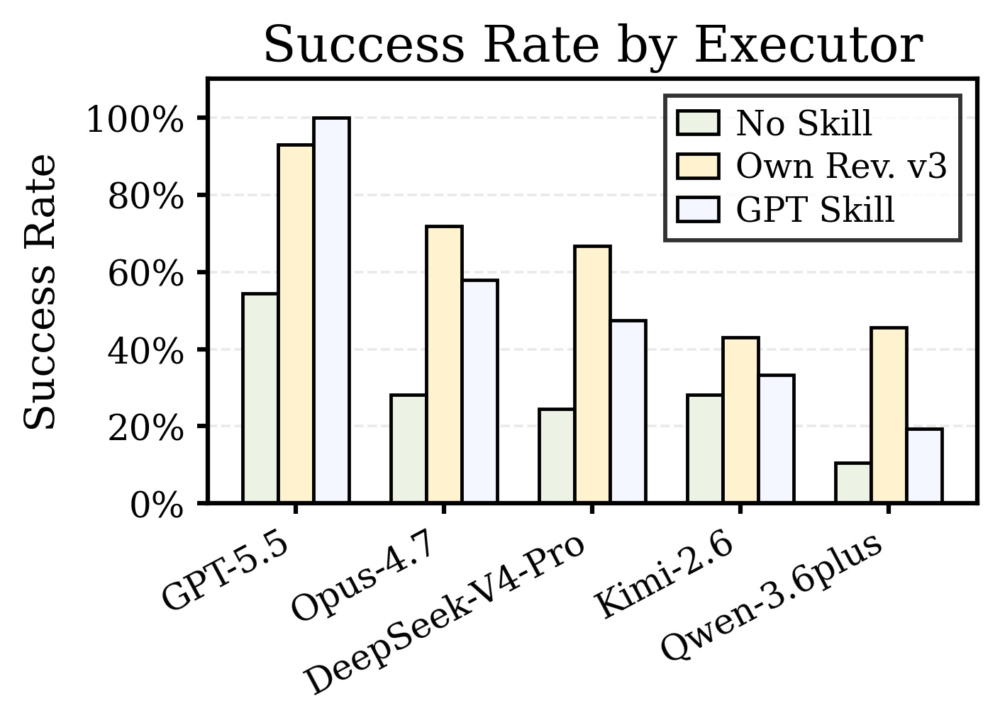

# Bundled Benchmarks

The `data/` directory contains the final benchmark bundles used by the main SkillRevise experiments. Each bundle is already converted to a SkillsBench-style layout and can be loaded directly with `--manifest-kind skillsbench`.

## Bundles

| Bundle | Tasks | Manifest |
| --- | ---: | --- |
| `data/skillsbench/` | 86 | `data/skillsbench/skillsbench_tasks.json` |
| `data/skilllearnbench/` | 50 | `data/skilllearnbench/skillsbench_tasks.json` |
| `data/swe-skills-bench/` | 70 | `data/swe-skills-bench/skillsbench_tasks.json` |

## Paper Protocol

The paper evaluates a unified verifier-driven protocol across these three benchmark sources:

- **SkillsBench**: professional agent tasks in the original SkillsBench-style interface.
- **SkillLearnBench-Random**: a 50-task SkillLearnBench subset exported into independent SkillsBench-style task directories.
- **SWE-Skills-Bench-Hard**: a 70-task software-engineering subset exported into the same task interface while preserving repository prompts, environments, and test-based evaluators.

The main setting uses a revision budget of three rounds. Skill authoring and revision use GPT-5.5 unless otherwise stated, and executor models vary across the reported runs.

## Main GPT-5.5 Results

| Benchmark | No skill | Skill-Creator | Skill v0 | SkillRevise v3 |
| --- | ---: | ---: | ---: | ---: |
| SkillsBench | 31/86 | 34/86 | 35/86 | **53/86** |
| SkillLearnBench-Random | 20/50 | 17/50 | 23/50 | **29/50** |
| SWE-Skills-Bench-Hard | 28/70 | 27/70 | 29/70 | **33/70** |

`Skill v0` is the initial skill inside the revision run before any revision. `SkillRevise v3` is the best observed skill within the three-round budget after re-execution and utility-gated selection.

The paper also studies cross-model transfer on the 57-task GPT-5.5 source-success subset:



## Common Layout

Each bundle contains:

- `README.md`: bundle-specific notes.
- `skillsbench_tasks.json`: manifest consumed by the SkillRevise loader.
- `all_jobs.json`: compact task-id list for batch launchers.
- `tasks/`: materialized task directories.

Each task directory is expected to contain:

- `instruction.md`: task instruction shown to the agent.
- `task.toml`: SkillsBench-style task metadata.
- `environment/`: task files, repositories, fixtures, or other inputs.
- `tests/test.sh`: verifier entrypoint.

The manifest is a JSON object with `benchmark`, `count`, and `tasks` fields. Each task item contains a `task_id`, `family`, instruction text, acceptance criteria, tags or context when available, and metadata. For bundled tasks, `metadata.repo_path` is relative to the repository root so it works when commands are run with `--workspace-root .`.

## Loading Bundles

From the repository root:

```bash
skillrevise data/skillsbench/skillsbench_tasks.json \
  --manifest-kind skillsbench \
  --workspace-root .

skillrevise data/skilllearnbench/skillsbench_tasks.json \
  --manifest-kind skillsbench \
  --workspace-root .

skillrevise data/swe-skills-bench/skillsbench_tasks.json \
  --manifest-kind skillsbench \
  --workspace-root .
```
